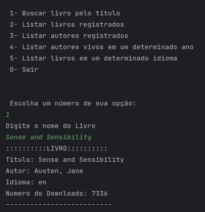
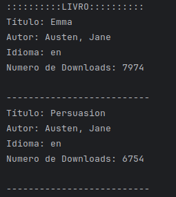
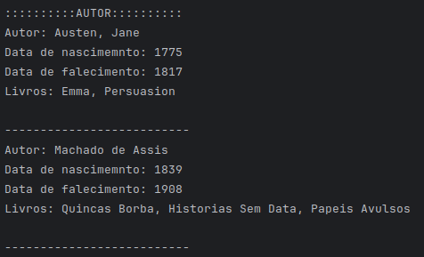
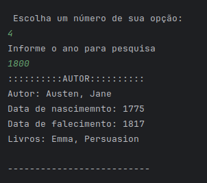
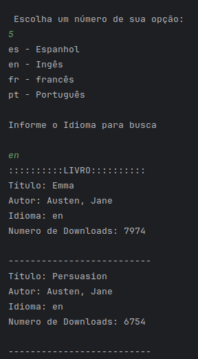

# Projeto Literalura

2. Este projeto faz parte da formação **Alura ONE**, uma parceria entre a **Alura** e a **Oracle**, com o objetivo de criar uma aplicação backend utilizando **Spring Boot** e **PostgreSQL**. O sistema permite a consulta e o registro de livros e autores a partir da **API Gutendex**.

## Funcionalidades

O projeto oferece as seguintes funcionalidades:
1. **Buscar livro pelo título**: Pesquisa de livros por nome, utilizando a API Gutendex.



2. **Listar livros registrados**: Exibe todos os livros registrados no banco de dados.



3. **Listar autores registrados**: Exibe todos os autores registrados no banco de dados.



4. **Listar autores vivos em um determinado ano**: Pesquisa autores que estavam vivos em um ano especificado.



5. **Listar livros em um determinado idioma**: Exibe livros registrados que estão disponíveis em um idioma específico.



## Tecnologias Utilizadas

- **Spring Boot**: Framework para desenvolvimento de aplicações backend.
- **PostgreSQL**: Banco de dados relacional utilizado para armazenar os livros e autores.
- **API Gutendex**: API externa para busca de livros gratuitos.
- **JPA/Hibernate**: Para manipulação de dados no banco de dados.
- **Jackson**: Para conversão de JSON em objetos Java.

## Como Rodar o Projeto

### Pré-requisitos

- **Java 17** ou superior
- **PostgreSQL** configurado e em funcionamento
- **Maven** para gerenciamento de dependências e execução do projeto

### Passos para execução

1. Clone este repositório:
   ```bash
   git clone https://github.com/seu_usuario/literalura.git
   ```

2. Entre no diretório do projeto:
   ```bash
   cd literalura
   ```

3. Configure as credenciais do banco de dados no arquivo `application.properties`:
   ```properties
   spring.application.name=literalura
   spring.datasource.url=jdbc:postgresql://${DB_HOST}/${DB_NAME}
   spring.datasource.username=${DB_USER}
   spring.datasource.password=${DB_PASSWORD}
   spring.datasource.driver-class-name=org.postgresql.Driver
   hibernate.dialect=org.hibernate.dialect.HSQLDialect
   spring.jpa.hibernate.ddl-auto=update
   ```

4. Rode o projeto com o Maven:
   ```bash
   mvn spring-boot:run
   ```

5. O sistema estará disponível na linha de comando para interação com o menu principal, onde você poderá realizar as buscas e registrar livros e autores.

## Estrutura do Projeto

### 1. **Pacotes principais**:

- `com.mvicente.literalura`: Pacote principal contendo a classe `LiteraluraApplication`, que inicia o aplicativo.
- `com.mvicente.literalura.mainmenu`: Contém a classe `MainMenu`, responsável por exibir o menu e gerenciar as interações com o usuário.
- `com.mvicente.literalura.repository`: Contém os repositórios do JPA para **Autor** e **Livro**.
- `com.mvicente.literalura.model`: Contém as classes de modelo para **Autor** e **Livro**, incluindo as classes auxiliares como `AuthorData` e `BookData`.
- `com.mvicente.literalura.service`: Contém os serviços que consomem a API e convertem os dados JSON para objetos Java.

### 2. **Classes importantes**:

- **LiteraluraApplication**: Classe principal que inicia a aplicação e exibe o menu.
- **MainMenu**: Classe que exibe as opções do menu e executa as funcionalidades solicitadas pelo usuário.
- **BookRepository** e **AuthorRepository**: Interfaces do Spring Data JPA para acesso aos dados de livros e autores.
- **ApiConsumer**: Classe que realiza a requisição para a API Gutendex.
- **JsonConverter**: Classe que converte a resposta JSON da API em objetos Java.

## Contribuindo

Sinta-se à vontade para contribuir com melhorias ou correções! Para isso, basta fazer um **fork** deste repositório, realizar suas modificações e abrir um **pull request**.

## Licença

Este projeto está licenciado sob a Licença MIT. Veja o arquivo [LICENSE](LICENSE) para mais detalhes.